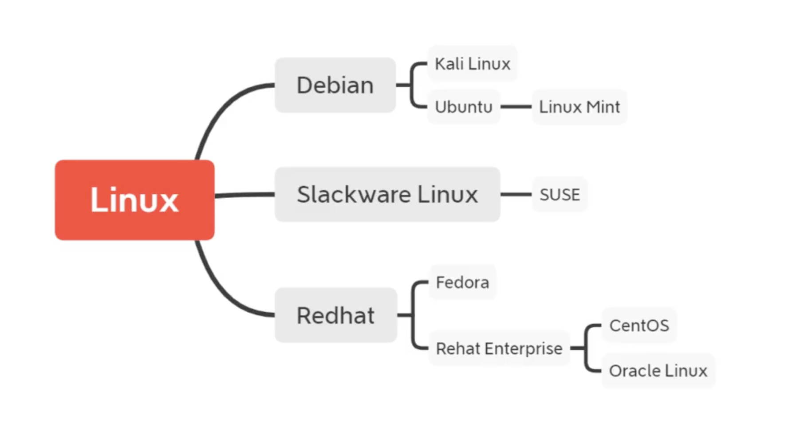

<!-- 常用命令汇总 -->
<!-- ===== -->
<!-- [TOC] -->
<!-- 十七、大规模机器学习(Large Scale Machine Learning) -->
<!-- -------------------------------------------------- -->

## Linux

### Linux分类


### 命令整理

#### 系统信息
```bash
# 显示机器的处理器架构
arch 
# 显示机器的处理器架构
uname -m 
# 查看操作系统信息
lsb_release -a 
# 查看红帽系列操作系统版本
cat /etc/redhat-release 
# 显示正在使用的内核版本
uname -r
# 显示硬件系统部件 - (SMBIOS / DMI)
dmidecode -q
# 查看CPU基本信息
lscpu
# 显示CPU info的信息
cat /proc/cpuinfo
# 显示中断
cat /proc/interrupts
# 查看内存基本信息
free -m
# 校验内存使用
cat /proc/meminfo
# 显示哪些swap被使用
cat /proc/swaps
# 显示内核的版本
cat /proc/version
# 显示网络适配器及统计
cat /proc/net/dev
# 显示已挂载的文件系统
cat /proc/mounts
# 罗列 PCI 设备
lspci -tv
# 显示系统日期
date
# 显示2007年的日历表
cal 2007
# 查看日期和时间 - 月日时分年.秒
date 041217002007.00
# 将时间修改保存到 BIOS
clock -w
# 设置系统名称
hostnamectl
```

#### 电源控制
```bash
# 关闭系统
shutdown -h now
# 关闭系统
init 0
# 关闭系统
telinit 0
# 按预定时间关闭系统
shutdown -h hours:minutes &
# 取消按预定时间关闭系统
shutdown -c
# 重启
shutdown -r now
# 重启
reboot
# 注销
logout
```

#### 磁盘空间
```bash
# 显示已经挂载的分区列表
df -h
# 以尺寸大小排列文件和目录
ls -lSr |more
# 估算目录 'dir1' 已经使用的磁盘空间
du -sh dir1
# 查看硬盘空间
du -sh * | sort -rh
# 以容量大小为依据依次显示文件和目录的大小
du -sk * | sort -rn
# 以大小为依据依次显示已安装的rpm包所使用的空间 (fedora, redhat类系统)
rpm -q -a --qf '%10{SIZE}t%{NAME}n' | sort -k1,1n
# 查看硬盘基本信息
lsblk
```

#### 挂载磁盘
```bash
# 挂载一个叫做hda2的盘 - 确定目录 '/ mnt/hda2' 已经存在
mount /dev/hda2 /mnt/hda2

# 卸载一个叫做hda2的盘 - 先从挂载点 '/ mnt/hda2' 退出
umount /dev/hda2

# 当设备繁忙时强制卸载
fuser -km /mnt/hda2

# 运行卸载操作而不写入 /etc/mtab 文件- 当文件为只读或当磁盘写满时非常有用
umount -n /mnt/hda2

# 挂载一个软盘
mount /dev/fd0 /mnt/floppy

# 挂载一个cdrom或dvdrom
mount /dev/cdrom /mnt/cdrom

# 挂载一个cdrw或dvdrom
mount /dev/hdc /mnt/cdrecorder

# 挂载一个cdrw或dvdrom
mount /dev/hdb /mnt/cdrecorder

# 挂载一个文件或ISO镜像文件
mount -o loop file.iso /mnt/cdrom

# 挂载一个Windows FAT32文件系统
mount -t vfat /dev/hda5 /mnt/hda5

# 挂载一个usb 捷盘或闪存设备
mount /dev/sda1 /mnt/usbdisk

# 挂载一个windows网络共享
mount -t smbfs -o username=user,password=pass //WinClient/share /mnt/share

```

#### 磁盘分析
```bash
# 检查磁盘hda1上的坏磁块
badblocks -v /dev/hda1

# 修复/检查hda1磁盘上linux文件系统的完整性
fsck /dev/hda1

# 修复/检查hda1磁盘上ext2文件系统的完整性
fsck.ext2 /dev/hda1

# 修复/检查hda1磁盘上ext2文件系统的完整性
e2fsck /dev/hda1

# 修复/检查hda1磁盘上ext3文件系统的完整性
e2fsck -j /dev/hda1

# 修复/检查hda1磁盘上ext3文件系统的完整性
fsck.ext3 /dev/hda1

# 修复/检查hda1磁盘上fat文件系统的完整性
fsck.vfat /dev/hda1

# 修复/检查hda1磁盘上dos文件系统的完整性
fsck.msdos /dev/hda1

# 修复/检查hda1磁盘上dos文件系统的完整性
dosfsck /dev/hda1

```

#### 用户和群组
```bash
# 创建一个新用户组
groupadd group_name
# 删除一个用户组
groupdel group_name
# 重命名一个用户组
groupmod -n new_group_name old_group_name
# 创建一个属于 "admin" 用户组的用户
useradd -c "Name Surname " -g admin -d /home/user1 -s /bin/bash user1
# 创建一个新用户
useradd user1
# 删除一个用户 ( '-r' 排除主目录)
userdel -r user1
# 修改用户属性
usermod -c "User FTP" -g system -d /ftp/user1 -s /bin/nologin user1
# 修改口令
passwd
# 修改一个用户的口令 (只允许root执行)
passwd user1
# 设置用户口令的失效期限
chage -E 2005-12-31 user1
# 检查 '/etc/passwd' 的文件格式和语法修正以及存在的用户
pwck
# 检查 '/etc/passwd' 的文件格式和语法修正以及存在的群组
grpck
# 登陆进一个新的群组以改变新创建文件的预设群组
newgrp group_name

```

#### 文件和目录
```bash
# 进入 '/ home' 目录
cd /home

# 返回上一级目录
cd ..

# 返回上两级目录
cd ../..

# 进入个人的主目录
cd

# 进入个人的主目录
cd ~user1

# 返回上次所在的目录
cd -

# 显示工作路径
pwd

# 查看目录中的文件
ls

# 查看目录中的文件
ls -F

# 显示文件和目录的详细资料
ls -l

# 显示隐藏文件
ls -a

# 显示包含数字的文件名和目录名
ls *[0-9]*

# 显示文件和目录由根目录开始的树形结构
tree

# 创建一个叫做 'dir1' 的目录
mkdir dir1

# 同时创建两个目录
mkdir dir1 dir2

# 创建一个目录树
mkdir -p /tmp/dir1/dir2

# 删除一个叫做 'file1' 的文件
rm -f file1

# 删除一个叫做 'dir1' 的目录
rmdir dir1

# 删除一个叫做 'dir1' 的目录并同时删除其内容
rm -rf dir1

# 同时删除两个目录及它们的内容
rm -rf dir1 dir2

# 重命名/移动 一个目录
mv dir1 new_dir

# 复制一个文件
cp file1 file2

# 复制一个目录下的所有文件到当前工作目录
cp dir/* .

# 复制一个目录到当前工作目录
cp -a /tmp/dir1 .

# 复制一个目录
cp -a dir1 dir2

# 创建一个指向文件或目录的软链接
ln -s file1 lnk1

# 创建一个指向文件或目录的物理链接
ln file1 lnk1

# 修改一个文件或目录的时间戳 - (YYMMDDhhmm)
touch -t 0712250000 file1

# 输出文件的 mime 类型
file file1

# 列出已知的编码
iconv -l

# 转换文件的编码格式并输出到 outputFile
iconv -f fromEncoding -t toEncoding inputFile > outputFile

# 批量调整当前目录中的图片文件大小
# 并将它们发送到缩略图(thumbs 自定义)目录
# (需预先安装 convert 命令)
find . -maxdepth 1 -name *.jpg -print -exec convert "{}" -resize 80x60 "thumbs/{}" \;
```

#### 文件搜索
```bash
# 从 '/' 开始进入根文件系统搜索文件和目录
find / -name file1

# 搜索属于用户 'user1' 的文件和目录
find / -user user1

# 在目录 '/ home/user1' 中搜索带有'.bin' 结尾的文件
find /home/user1 -name \*.bin

# 搜索在过去100天内未被使用过的执行文件
find /usr/bin -type f -atime +100

# 搜索在10天内被创建或者修改过的文件
find /usr/bin -type f -mtime -10

# 搜索以 '.rpm' 结尾的文件并定义其权限
find / -name \*.rpm -exec chmod 755 '{}' \;

# 搜索以 '.rpm' 结尾的文件，忽略光驱、键盘等可移动设备
find / -xdev -name \*.rpm

# 寻找以 '.ps' 结尾的文件 - 先运行 'updatedb' 命令(需要安装locate命令)
locate \*.ps

# 显示一个二进制文件、源码或man的位置
whereis halt

# 显示一个二进制文件或可执行文件的完整路径
which halt
```

#### 格式化文件系统
```bash
# 在hda1分区创建一个文件系统
mkfs /dev/hda1

# 在hda1分区创建一个linux ext2的文件系统
mke2fs /dev/hda1

# 在hda1分区创建一个linux ext3(日志型)的文件系统
mke2fs -j /dev/hda1

# 创建一个 FAT32 文件系统
mkfs -t vfat 32 -F /dev/hda1

# 格式化一个软盘
fdformat -n /dev/fd0

# 创建一个swap文件系统
mkswap /dev/hda3

```

#### SWAP文件系统
```bash
# 创建一个swap文件系统
mkswap /dev/hda3

# 启用一个新的swap文件系统
swapon /dev/hda3

# 启用两个swap分区
swapon /dev/hda2 /dev/hdb3

```


#### 备份
```bash
# 制作一个 '/home' 目录的完整备份
dump -0aj -f /tmp/home0.bak /home

# 制作一个 '/home' 目录的交互式备份
dump -1aj -f /tmp/home0.bak /home

# 还原一个交互式备份
restore -if /tmp/home0.bak

# 同步两边的目录
rsync -rogpav --delete /home /tmp

# 通过SSH通道rsync
rsync -rogpav -e ssh --delete /home ip_address:/tmp

# 通过ssh和压缩将一个远程目录同步到本地目录
rsync -az -e ssh --delete ip_addr:/home/public /home/local

# 通过ssh和压缩将本地目录同步到远程目录
rsync -az -e ssh --delete /home/local ip_addr:/home/public

# 通过ssh在远程主机上执行一次备份本地磁盘的操作
dd bs=1M if=/dev/hda | gzip | ssh user@ip_addr 'dd of=hda.gz'

# 备份磁盘内容到一个文件
dd if=/dev/sda of=/tmp/file1

# 执行一次对 '/home/user' 目录的交互式备份操作
tar -Puf backup.tar /home/user

# 通过ssh在远程目录中复制一个目录内容
( cd /tmp/local/ && tar c . ) | ssh -C user@ip_addr 'cd /home/share/ && tar x -p'

# 通过ssh在远程目录中复制一个本地目录
( tar c /home ) | ssh -C user@ip_addr 'cd /home/backup-home && tar x -p'

# 本地将一个目录复制到另一个地方，保留原有权限及链接
tar cf - . | (cd /tmp/backup ; tar xf - )

# 从一个目录查找并复制所有以 '.txt' 结尾的文件到另一个目录
find /home/user1 -name '*.txt' | xargs cp -av --target-directory=/home/backup/ --parents

# 查找所有以 '.log' 结尾的文件并做成一个bzip包
find /var/log -name '*.log' | tar cv --files-from=- | bzip2 > log.tar.bz2

# 做一个将 MBR (Master Boot Record)内容复制到软盘的动作
dd if=/dev/hda of=/dev/fd0 bs=512 count=1

# 从已经保存到软盘的备份中恢复MBR内容
dd if=/dev/fd0 of=/dev/hda bs=512 count=1

```

#### 光盘与镜像
```bash
# 清空一个可复写的光盘内容
cdrecord -v gracetime=2 dev=/dev/cdrom -eject blank=fast -force

# 在磁盘上创建一个光盘的iso镜像文件
mkisofs /dev/cdrom > cd.iso

# 在磁盘上创建一个压缩了的光盘iso镜像文件
mkisofs /dev/cdrom | gzip > cd_iso.gz

# 创建一个目录的iso镜像文件
mkisofs -J -allow-leading-dots -R -V "Label CD" -iso-level 4 -o ./cd.iso data_cd

# 刻录一个ISO镜像文件
cdrecord -v dev=/dev/cdrom cd.iso

# 刻录一个压缩了的ISO镜像文件
gzip -dc cd_iso.gz | cdrecord dev=/dev/cdrom -

# 挂载一个ISO镜像文件
mount -o loop cd.iso /mnt/iso

# 从一个CD光盘转录音轨到 wav 文件中
cd-paranoia -B

# 从一个CD光盘转录音轨到 wav 文件中（参数-3）
cd-paranoia -- "-3"

# 扫描总线以识别scsi通道
cdrecord --scanbus

# 校验一个设备的md5sum编码，例如一张 CD
dd if=/dev/hdc | md5sum

```

#### 网络
```bash
# 显示网卡 'eth0' 的配置
ifconfig eth0

# 启用一个 'eth0' 网络设备
ifup eth0

# 禁用一个 'eth0' 网络设备
ifdown eth0

# 设置网卡的IP地址
ifconfig eth0 192.168.1.1 netmask 255.255.255.0

# 设置 'eth0' 成混杂模式以嗅探数据包 (sniffing)
ifconfig eth0 promisc

# 以dhcp模式启用 'eth0'
dhclient eth0

# 展示路由表
route -n

# 设置路由的默认网关
route add -net 0/0 gw IP_Gateway

# 设置路由可到达的网络范围 '192.168.0.0/16'
route add -net 192.168.0.0 netmask 255.255.0.0 gw 192.168.1.1

# 删除路由网关
route del 0/0 gw IP_gateway

# 激活IP路由
echo "1" > /proc/sys/net/ipv4/ip_forward

# 现实系统主机名
hostname

# 反向解析主机地址
host www.example.com

# 反向解析主机地址
nslookup www.example.com

# 查看所有网卡的连接状态
ip link

# 查看网卡 'eth0' 的连接状态
mii-tool eth0

# 统计网卡 'eth0' 的信息
ethtool eth0

# 查看所有已激活的网络连接和他们的PID
netstat -tup

# 查看所有已激活的网络服务端口和他们的PID
netstat -tupl

# 查看端口占用(只看端口)
netstat -tnpl

# 查看Http的传输信息
tcpdump tcp port 80

# 查看无线网络
iwlist scan

# 查看无线网卡
iwconfig eth1

# 在whois数据库中查看主机详情
whois www.example.com

# 查看DNS 的配置信息
cat /etc/resolv.conf

# 查看端口占用
ss -tnpl

```


## Mac命令

### 常用

查看进程对应端口
```sh
sudo lsof -nP -p 进程号 | grep LISTEN
```

### 目录操作
| 命令名 | 功能描述             | 使用举例         |
|--------|----------------------|------------------|
| mkdir  | 创建一个目录         | mkdir dirname    |
| rmdir  | 删除一个目录         | rmdir dirname    |
| mvdir  | 移动或重命名一个目录 | mvdir dir1 dir2  |
| cd     | 改变当前目录         | cd dirname       |
| pwd    | 显示当前目录的路径名 | pwd              |
| ls     | 显示当前目录的内容   | ls -la           |
| dircmp | 比较两个目录的内容   | dircmp dir1 dir2 |

### 文件操作
| 令名 | 功能描述               | 使用举例                  |
|------|------------------------|---------------------------|
| cat  | 显示或连接文件         | cat filename              |
| pg   | 分页格式化显示文件内容 | pg filename               |
| more | 分屏显示文件内容       | more filename             |
| od   | 显示非文本文件的内容   | od -c filename            |
| cp   | 复制文件或目录         | cp file1 file2            |
| rm   | 删除文件或目录         | rm filename               |
| mv   | 改变文件名或所在目录   | mv file1 file2            |
| ln   | 联接文件               | ln -s file1 file2         |
| find | 使用匹配表达式查找文件 | find . -name "*.c" -print |
| file | 显示文件类型           | file filename             |
| open | 使用默认的程序打开文件 | open filename             |

### 选择操作
| 命令名 | 功能描述                       | 使用举例                     |
|--------|--------------------------------|------------------------------|
| head   | 显示文件的最初几行             | head -20 filename            |
| tail   | 显示文件的最后几行             | tail -15 filename            |
| cut    | 显示文件每行中的某些域         | cut -f1,7 -d: /etc/passwd    |
| colrm  | 从标准输入中删除若干列         | colrm 8 20 file2             |
| paste  | 横向连接文件                   | paste file1 file2            |
| diff   | 比较并显示两个文件的差异       | diff file1 file2             |
| sed    | 非交互方式流编辑器             | sed "s/red/green/g" filename |
| grep   | 在文件中按模式查找             | gep "^[a-zA-Z]" filename     |
| awk    | 在文件中查找并处理模式         | awk '{print $1 $1}' filename |
| sort   | 排序或归并文件                 | sort -d -f -u file1          |
| uniq   | 去掉文件中的重复行             | uniq file1 file2             |
| comm   | 显示两有序文件的公共和非公共行 | comm file1 file2             |
| wc     | 统计文件的字符数、词数和行数   | wc filename                  |
| nl     | 给文件加上行号                 | nl file1 >file2              |

### 安全操作
| 命令名 | 功能描述               | 使用举例                |
|--------|------------------------|-------------------------|
| passwd | 修改用户密码           | passwd                  |
| chmod  | 改变文件或目录的权限   | chmod ug+x filename     |
| umask  | 定义创建文件的权限掩码 | umask 027               |
| chown  | 改变文件或目录的属主   | chown newowner filename |
| chgrp  | 改变文件或目录的所属组 | chgrp staff filename    |
| xlock  | 给终端上锁             | xlock -remote           |

### 编程操作
| 命令名 | 功能描述                 | 使用举例                   |
|--------|--------------------------|----------------------------|
| make   | 维护可执行程序的最新版本 | make                       |
| touch  | 更新文件的访问和修改时间 | touch -m 05202400 filename |
| dbx    | 命令行界面调试工具       | dbx a.out                  |
| xde    | 图形用户界面调试工具     | xde a.out                  |

### 进程操作
| 命令名 | 功能描述               | 使用举例         |
|--------|------------------------|------------------|
| ps     | 显示进程当前状态       | ps u             |
| kill   | 终止进程               | kill -9 30142    |
| nice   | 改变待执行命令的优先级 | nice cc -c *.c   |
| renice | 改变已运行进程的优先级 | renice +20 32768 |

### 时间操作
| 命令名         | 功能描述                          | 使用举例                    |
|----------------|-----------------------------------|-----------------------------|
| date           | 显示系统的当前日期和时间          | date                        |
| cal            | 显示日历                          | cal 8 1996                  |
| time           | 统计程序的执行时间                | time a.out                  |

### 网络与通信操作
| 命令名 | 功能描述                          | 使用举例                    |
|--------|-----------------------------------|-----------------------------|
| telnet | 远程登录                          | telnet hpc.sp.net.edu.cn    |
| rlogin | 远程登录                          | rlogin hostname -l username |
| rsh    | 在远程主机执行指定命令            | rsh f01n03 date             |
| ftp    | 在本地主机与远程主机之间传输文件  | ftp ftp.sp.net.edu.cn       |
| rcp    | 在本地主机与远程主机 之间复制文件 | rcp file1 host1:file2       |
| ping   | 给一个网络主机发送 回应请求       | ping hpc.sp.net.edu.cn      |
| mail   | 阅读和发送电子邮件                | mail                        |
| write  | 给另一用户发送报文                | write username pts/1        |
| mesg   | 允许或拒绝接收报文                | mesg n                      |

### Korn Shell 命令
| 命令名  | 功能描述                        | 使用举例        |
|---------|---------------------------------|-----------------|
| history | 列出最近执行过的 几条命令及编号 | history         |
| r       | 重复执行最近执行过的 某条命令   | r -2            |
| alias   | 给某个命令定义别名              | alias del=rm -i |
| unalias | 取消对某个别名的定义            | unalias del     |

### 其它命令
| 命令名 | 功能描述                       | 使用举例     |
|--------|--------------------------------|--------------|
| uname  | 显示操作系统的有关信息         | uname -a     |
| clear  | 清除屏幕或窗口内容             | clear        |
| env    | 显示当前所有设置过的环境变量   | env          |
| who    | 列出当前登录的所有用户         | who          |
| whoami | 显示当前正进行操作的用户名     | whoami       |
| tty    | 显示终端或伪终端的名称         | tty          |
| stty   | 显示或重置控制键定义           | stty -a      |
| du     | 查询磁盘使用情况               | du -k subdir |
| df     | 显示文件系统的总空间和可用空间 | df /tmp      |
| w      | 显示当前系统活动的总信息       | w            |


## Windows 命令

### 进程

1. 查看某个进程的详细信息

```ps
wmic process where caption="java.exe" get processid,caption,commandline /value
```

2. 查看进程列表
```ps
tasklist|findstr "java"
```

3. 杀死进程
```ps
taskkill /F /pid $PID -t
```
/F: 强制关闭

4. 查看进程对应端口
```ps
netstat -ano|findstr "8080"
```

5. 通过 gpedit.msc [配置策略](https://new.qq.com/omn/20220107/20220107A02GQ400.html)
